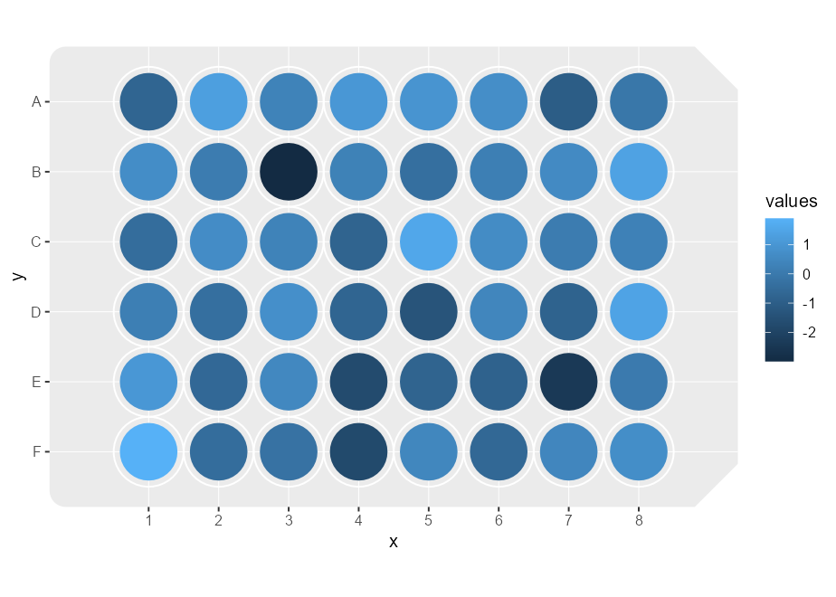
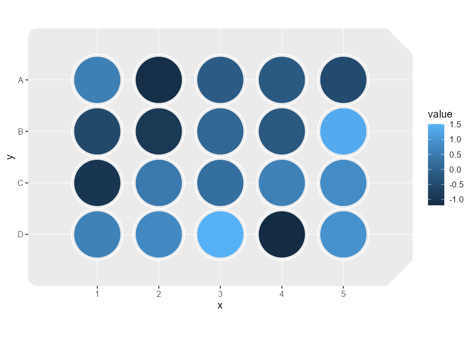
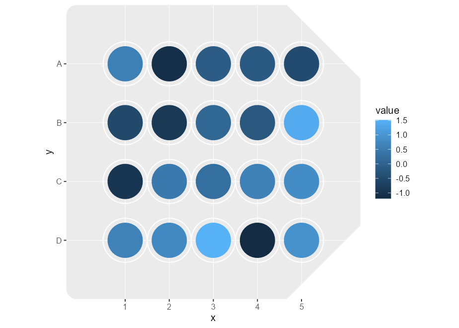
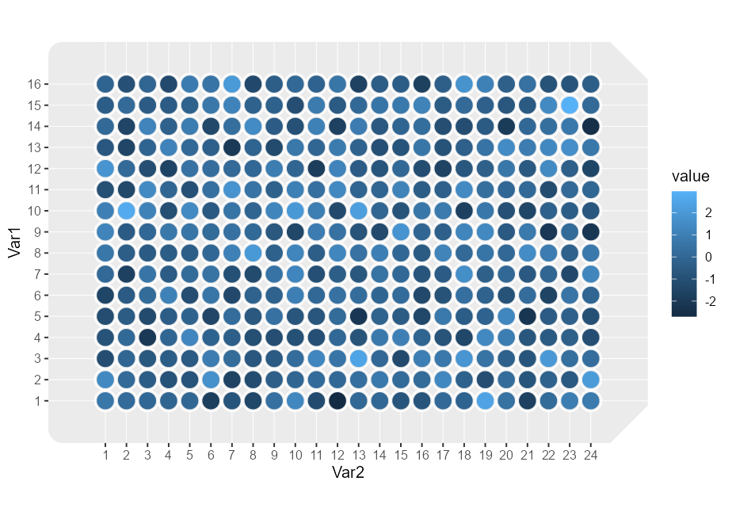

<!-- README.md is generated from README.Rmd. Please edit that file -->

# ggplateplot

<!-- badges: start -->
<!-- badges: end -->

Well, well, well… it seems you’ve found this package for plotting:
wells.

The goal of ggplateplot is to extend {ggplot2} to make it easier to make
plots resembling cell culture microwell plates. This packages takes care
of some of the layouts, leaving the flexibility of {ggplot2} and
extensions to add layers, scales, theme adjustments etc.

## Installation

You can install the development version of ggplateplot like so:

``` r
# FILL THIS IN! HOW CAN PEOPLE INSTALL YOUR DEV PACKAGE?
```

## Example

This is a terse example of how one could make a plot from a `matrix` of
values.

``` r
library(ggplot2)
library(ggplateplot)

plate <- matrix(rnorm(24), nrow = 4, ncol = 6)

ggplateplot(plate, aes(fill = value)) +
  geom_well()
```


Instead of providing a `matrix`, we can also provide long-format data.
It should automatically detect an appropriate layout for the plate based
on the number of rows in the `data` argument, when it has 6, 12, 24, 48,
96 or 384 rows.

``` r
df <- expand.grid(
  x = 1:8,
  y = LETTERS[1:6]
)
df$values <- rnorm(nrow(df))

ggplateplot(df, aes(x, y, fill = values)) +
  geom_well()
```



## How does it work?

The `ggplateplot()` function above is a thin wrapper around the
`ggplot()` function. It does a few automated things to make your plots
look more like cell culture plates. Below are some components of the
plots above.

### Geom

First off, the {ggplateplot} package has a specialised layer (geom) for
drawing wells. This isn’t a particularly exciting layer as it just draws
circles as you would with `geom_point()`. A small bit of magic comes
from combining this geom with `coord_plate()`, in that the `size`
aesthetic is synced with the diameter of wells.

``` r
p <- ggplot(df, aes(x, y, fill = values)) +
  geom_well()
p
```


### Coord

The crux of {ggplateplot} is `coord_plate()`, which modifies how several
panel components of a plot are drawn.

#### Theming

The following adjustments to the theming of a plot are made.

-   The `panel.background` and `panel.border` follow the shape of a
    microwell plate. Corners are rounded a little bit and you can ‘bite’
    off some corners with the `corner` argument to resemble a microwell
    plate better.
-   The `panel.grid.major` now draws circles around the wells.
-   The `panel.grid.minor` performs the role of the major panel grid.

``` r
p + coord_plate(corner = "topright", spec = 48) +
  theme(
    panel.grid.major = element_line(colour = "dodgerblue"),
    panel.grid.minor = element_line(colour = "tomato"),
    panel.background = element_rect(colour = "black", fill = "white")
  )
```


#### Layout

The `coord_plate()` function has a `specs` argument that takes a
description of a well plate. We’ve included descriptions for 6, 12, 24,
48, 96 and 384-well plates in the package. If we mismatch the number of
datapoints with the layout, as in the example below, we might get
inappropriate layouts.

``` r
p + coord_plate(specs = 96)
```


To offer slightly more flexibility than the standard layouts, you can
set a custom layout with `custom_plate_spec()`.

``` r
df <- data.frame(
  x = rep(1:5, each = 4),
  y = rep(LETTERS[1:4], 5),
  value = rnorm(20)
)

ggplot(df, aes(x, y, fill = value)) +
  geom_well() +
  coord_plate(spec = custom_plate_spec(ncol = 5, nrow = 4))
```



If you want to even further customise the layout, you can use
`new_plate_spec()` to control even more parameters of the layout.

``` r
spec <- new_plate_spec(
  width = 100, height = 100,
  hor_spacing = 15,
  ver_spacing = 20,
  well_diameter = 12, 
  ncol = 5, nrow = 4,
  corner_size = 25
)

ggplot(df, aes(x, y, fill = value)) +
  geom_well() +
  coord_plate(spec = spec)
```



### Circling back

So what does `ggplateplot()` do exactly? Well, it just tries to
automatically match the shape of your data to an appropriate setting for
`coord_plate()`. If you have data that doesn’t match the dimensions of
one of the standard plates, we recommend that you simply use
`ggplot() + coord_plate()` instead, and customise from there. For
`matrix` input, it additionally converts it to long format and
automatically sets `x` and `y` aesthetics. The values in the matrix are
converted to a `value` column.

``` r
plate <- matrix(rnorm(384), ncol = 24, nrow = 16)

ggplateplot(plate, aes(fill = value)) +
  geom_well()
```


